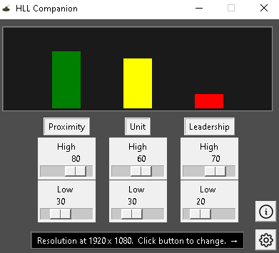
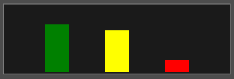
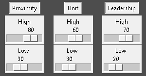

<base target="_blank">

# Overview

This app is designed to allow for on the fly balancing of the in game chat for Hll. It's written in Python, and uses the pynput library to both listen for and execute mouse events in game.  

The macros are currently only accurate when in a match and spawned in.  

### Volume Bars

The bars at the top of the window represent the currently set volumes in Hll. They do not reflect the values of the sliders until a hotkey action is triggered.

### Preset Sliders  

The sliders represent the target values for a triggered hotkey action. For example, setting a slider to 50 and then triggering the corresponding hotkey will start a macro which will set the ingame value to 50%.

### Log Bar

The log bar is used for relaying information important to the app, including settings saves and the progress of triggered actions.

### Info Menu

This menu displays reference to the hotkey combinations, as well as providing a link to my Buy Me A Beer page.

### Settings Menu

The resolution setting is used for the adjusting output of macros, not for displaying the app.  
There is also an option for always displaying this app over other windows.  

# Compatibility

Tested on Windows 10

# Install Instructions

1. Right click and select "Open in New Tab" to open the download link: [Hll Companion](https://www.mediafire.com/file/5gthfkp1jp7tlqr/Hll_Companion_v1.3.zip/file)  
2. Click the download button.  
3. In the downloads bar on the bottom of the browser window, click the ^ button and then choose "Keep".
3.5. Alternatively, go to your browser's downloads menu, expand the options for the download, and choose "Keep".
4. In the downloads folder, right click on "Hll Companion.zip", and extract the folder.  
5. Your extracted folder will hold "Hll Companion.exe" and a README.md.
6. You're good to go! Make sure to run as administrator. The exe is portable, and will run from the location of your choice. If your resolution isn't 1920x1080, make sure to change it in the settings.  

# Starting the App

1. Right click on Hll Companion.exe.  
2. Select "Run as administrator".  
3. If it is your first time running the app, make sure to set your resolution in the settings menu. (Gear button on the bottom right)  
4. Hotkey reference can be found in the information menu. (Info button above the settings button)